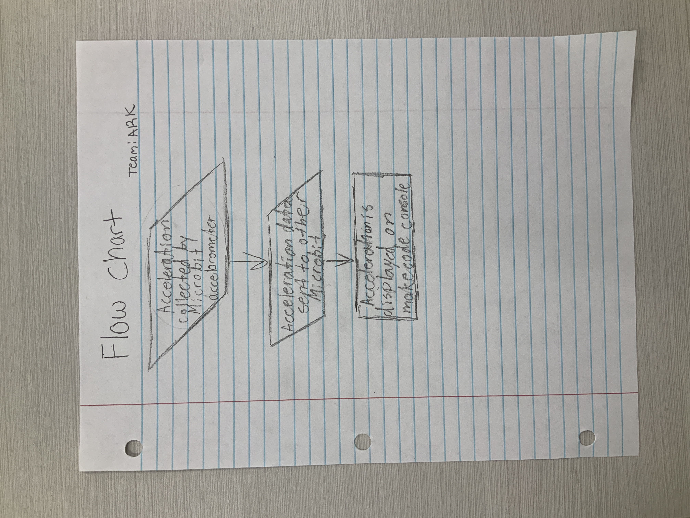

# Mission-to-Mars-Documentation
# Team-name- ARK


# Summary
The core idea was to create a simple box we could open and close easily while still succeeding at protecting our battery and microbit. We first attempted to create a box with hinged door to easily open and close; However, printing on such a small scale had us encountering problems with creating circular holes that would line up, becuase of this we changed our design to a more simplilar box with a roof that has two plastic clips to hold the roof down.

## Receiver Code

```python
basic.show_string("RECEIVER")
radio.set_group(10)

def on_received_value(name, value):
    led.toggle(0, 0)
    serial.write_value(name, value)
radio.on_received_value(on_received_value)
```

## Sender Code

```python
radio.set_group(10)
def on_forever():
    led.toggle(0, 0)
    radio.send_value("X", input.acceleration(Dimension.X))
    radio.send_value("Y", input.acceleration(Dimension.Y))
    radio.send_value("Z", input.acceleration(Dimension.Z))
    radio.send_value("Compass", input.compass_heading())
    basic.pause(50)
basic.forever(on_forever)
```

# Process
Gather with your team. Discuss a plan and create a flow chart. Begin creating a prototype. Start programming your microbit. When code is complete, connect the microbits to the same radio group and test the code. Reflect on your case prototype and determine wether you need to print another one or not. When all is complete, you're ready to drop the microbit


# Team Reflection


# Design


# Flowchart


# Prototypes


